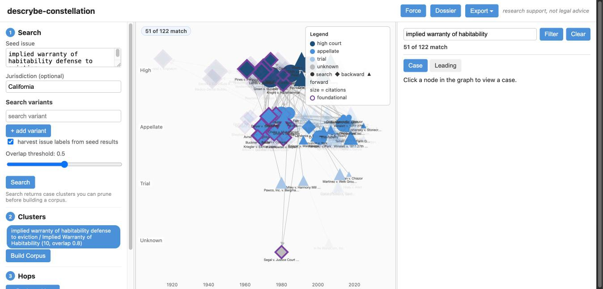
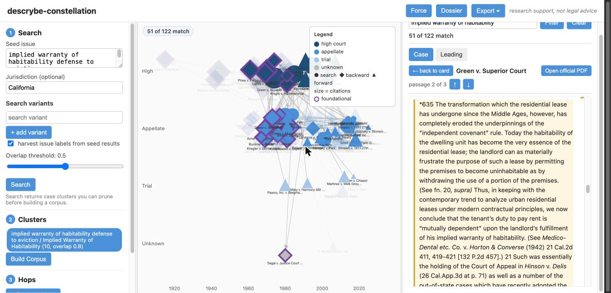

# descrybe-constellation

Explore legal issues and the citation network around them — and watch the leading and foundational cases emerge.

A local web app built on [Descrybe Legal Engine](https://github.com/descrybe-com/descrybe-legal-engine-python) (issue search, case summaries, issue-focused passages, treatment screening) and the [CourtListener API](https://www.courtlistener.com/help/api/) (the citation graph, both directions). Start from a plain-English issue, grow a case corpus by *issue hops* and *citation hops*, and rank cases by explainable structural signals — within-corpus citations and multi-issue membership — instead of a black-box relevance score.

**Status:** working prototype. Design and evidence: [`docs/design.md`](docs/design.md), [`docs/spike-findings.md`](docs/spike-findings.md), [`docs/ux-spec.md`](docs/ux-spec.md), [`docs/research/`](docs/research/).

Not legal advice — a research exploration tool. Outputs carry per-claim source labels (`[Descrybe]`, `[CourtListener]`, `[Needs verification]`) and treatment signals are always framed as screening results, not citator conclusions.



*The habitability corpus on the timeline: court-level lanes, year axis, foundational authority (purple diamonds) clustered in the pre-1980 high-court band, and the issue filter dimming citation-network neighbors that don't discuss the issue — 51 of 122 match, honestly labeled.*

**Try it without any accounts:** download [`demo/habitability-snapshot.html`](demo/habitability-snapshot.html) and open it in a browser — a self-contained interactive export of the graph above (no external requests, works from `file://`).

## Quickstart

```sh
python3 -m venv .venv
.venv/bin/pip install -r requirements.txt
.venv/bin/dle login                                # per-user Descrybe OAuth
echo "COURTLISTENER_API_TOKEN=your-token" >> .env   # free CourtListener token
.venv/bin/python scripts/serve.py                  # http://127.0.0.1:8737
```

You need a Descrybe account with Legal Engine access (per-user OAuth — no shared credentials) and a free CourtListener API token. If `data/vendor/cytoscape.min.js` is missing, the server prints the one-line `curl` to fetch it — vendored once, served locally, inlined into exports; the app makes no CDN requests at runtime.

Every API response is cached permanently in a local SQLite file (`data/cache.sqlite`), so repeating a search or reopening a corpus costs nothing.

## Walkthrough

The running example: *is breach of the implied warranty of habitability a defense to eviction for nonpayment of rent in California?*

### 1. Search (left pane, stage 1)

Type the issue in plain English as the **seed** — `implied warranty of habitability defense to eviction` — set jurisdiction `California`, and optionally add **variants**: reformulations of the same question (`habitability defects defense to nonpayment of rent`, a broader or opposing framing). Check **harvest issue labels** to have the app also search the issue labels Descrybe attaches to the seed's results. Hit **Search**.

### 2. Clusters (stage 2)

Each search comes back as a chip, and searches whose results overlap heavily are merged into one cluster (the overlap threshold is the slider). Chips above the threshold are included automatically — click any chip to include or exclude it. This is the pruning step: you decide which framings of the issue define the corpus. Then **Build Corpus**. On the example, the seed and its harvested label merge into one cluster of 8 distinct cases — *Green v. Superior Court*, *Stoiber v. Honeychuck*, *Hinson v. Delis*, and friends.

### 3. Hops (stage 3)

Two expansion moves, each an explicit button with a call-count preview:

- **Backward hop** — pulls each corpus case's table of authorities from CourtListener. Cases cited by two or more corpus members join the graph as *foundational candidates* (diamonds). This is where issue search gets transcended: on the example, the backward hop surfaces *Rowland v. Christian* and the products-liability warranty line (*Escola*, *Greenman*, *Vandermark*) — the doctrine *Green* was actually built from — plus the out-of-state anchors (*Marini*, *Lemle*, *Pines*, *Brown v. Southall Realty*). None of those appear in any habitability issue search.
- **Forward hop** — pulls later cases citing your search results (triangles), capped per case, with truncation always reported ("60 of 114 citers fetched"), never silent.

### 4. Read the graph (center pane)

- **Color** = court level (dark → high court, mid → appellate, light → trial). **Shape** = how the case entered (circle: issue search; diamond: cited-by-corpus; triangle: cites-corpus). **Size** = how often the case is cited overall (log scale). **Purple ring** = foundational: cited by multiple corpus members, decided before the corpus median, absent from issue search.
- Toggle **Timeline** in the header: x-axis becomes decision year, lanes become court level, and doctrine reads left-to-right as history — the pre-1980 high-court band of foundations, then the modern citing wave. Zoom spreads positions while glyphs stay a constant size, so zooming *resolves* overlaps.
- Panes are resizable (drag the dividers); sizes persist.

### 5. Filter by issue (right pane, top)

The graph deliberately contains *all* citations, not just issue-relevant ones — foundations are often from neighboring doctrine. The **filter bar** checks which cases' opinion text actually matches your issue terms (search-origin cases count automatically) and dims the rest to ghosts everywhere at once: graph, Leading table, foundational list, with an honest **"N of M match"** badge on each view. Nothing is ever hidden — you always see what the filter excluded. **Clear** restores.

### 6. Inspect cases (right pane)

Click any node (or row in the **Leading** tab, ranked by within-corpus citations → search membership → court weight — no composite scores). The case card shows court/date/citation counts tagged `[CourtListener]`, Descrybe's research-value and treatment lines, the full case summary, a status screening line, and a box to fetch a passage focused on any phrase.

**Read case** opens the reader: the full opinion (CourtListener text, sanitized), with Descrybe's issue-focused passages located and highlighted inside it — prev/next navigation, tick marks in the scroll gutter, and an **Open official PDF** button.

 Passage locations are found by a measured matching pipeline (~89% anchor rate across two test corpora); passages that cannot be located in the opinion text are shown in a **[Needs verification]** block above the opinion rather than dropped — if Descrybe returned it but CourtListener's text doesn't contain it, you deserve to know.

### 7. Take it with you (header)

- **Dossier** — an issue-level document assembled (not generated — no LLM writes a sentence) from the corpus: leading cases with summaries and issue passages, the foundational genealogy in date order, treatment cautions, per-block source labels. **Export ▾ → Export dossier** downloads it as a self-contained HTML file.
- **Export ▾ → Export snapshot** — the interactive graph as a single HTML file that opens from `file://` with zero external requests: shareable with someone who has no accounts at all.
- **Export ▾ → Export trail** — a Markdown log of the session: every search, inclusion decision, hop, and case viewed, with source labels and a research-current-through timestamp.

## How it works (short version)

Descrybe is the *content layer* (issue search, summaries, passages, screening); CourtListener is the *graph layer* (`opinions_cited` backward, `cites:` forward). The two share an ID namespace, verified empirically (`docs/spike-findings.md` F1). Ranking uses only explainable counts. The corpus engine is a plain-Python library (`constellation/`) independent of the web UI — `scripts/build_corpus.py` drives the same pipeline from the command line.

## License

Apache-2.0. Access to the hosted Descrybe Legal Engine service and the CourtListener API is separate and subject to their respective terms.
